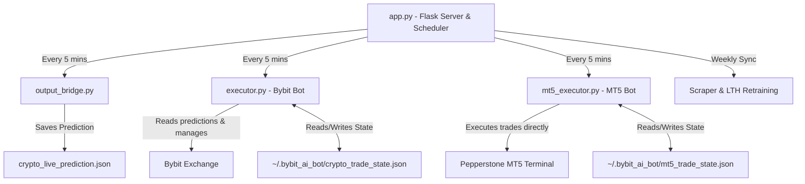

# AI Trading & Lotto Forecaster - System Blueprint & AI Handover Specification

This document serves as the absolute source of truth, mathematical design specification, and disaster recovery blueprint for the automated trading and lottery forecaster system. It is written to be instantly parsed, understood, and executed by any advanced AI coding assistant (e.g., Antigravity, Gemini, GPT, Claude) to resume, manage, or rebuild the system from scratch.

---

## 1. Project Vision & Core Strategy (Plan C)
* **Goal**: Compound a starting capital of **200 USD** (deposited on Pepperstone Live) to a target capital of **100,000 USD** by **December 2033** (approx. 7.5 years) using compounding exponential growth, then withdraw monthly profits.
* **Capital Reinvestment (Compounding)**: 100% of profits are reinvested. Positions increase in size proportionally to the account balance. No withdrawals are made until the target is reached.
* **Risk Model**: Dual-layer diversification:
  1. **Bybit (Aggressive Crypto - The Sword)**: 10x leveraged futures trading on high-volatility assets (BTC, ETH, SOL, RUNE).
  2. **Pepperstone MT5 (Conservative Traditional - The Shield)**: Leveraged trading on stable, highly liquid global markets (USD/JPY, Nasdaq 100, Gold).

---

## 2. Codebase Architecture

The project is structured as a Flask web dashboard integrated with a 24/7 background scheduler loop running decoupled subprocesses.



---

## 3. Mathematical & AI Modeling Engine

### A. Feature Extraction (`crypto/features.py`)
Computes stationary financial indicators from H1 (hourly) candlestick data:
1. **Trend**: Close price distance to SMA 10, EMA 10, and SMA 10/SMA 30 crossing.
2. **Volatility**: 10-period standard deviation of log returns.
3. **Momentum**: Relative Strength Index (RSI-14).
4. **Volume**: Percentage change in volume. To prevent `inf` errors from zero-volume hours (common in forex/commodities), infinite values are replaced with NaN and filled with 0:
   `df["volume_change"] = df["volume"].pct_change().replace([np.inf, -np.inf], np.nan).fillna(0)`

### B. Dual 4-Qubit Quantum Reservoir Computing (QRC) (`crypto/quantum_lotto.py`)
Simulates a quantum system of $N=4$ interacting qubits governed by a transverse-field Ising Hamiltonian:
\[H = \sum_{i<j} J_{ij} \sigma_i^z \sigma_j^z + \sum_{i} h_i \sigma_i^x\]
* **Input Injection**: Scaled features are injected as rotation angles for the qubits at each time step.
* **Output State**: The density matrix $\rho$ is evolved, and the diagonal elements (qubit populations) are extracted as 24 quantum features (12 per reservoir).
* **Total Features**: 8 classical indicators + 24 quantum features = **32 features total**.

### C. LSTM Price Predictor Models
* **Network Layout**: Sequential model with SpatialDropout1D, an LSTM layer (32 units, L2 regularization $1e-4$), a Dense layer (16 units, ReLU), and a Sigmoid output layer.
* **Prediction Target**: Sigmoid probability $P(up)$ that the next hourly close price will be higher than the current close.
* **Signal Thresholds**:
  * $P(up) > 0.53 \implies$ **BUY / LONG**
  * $P(up) < 0.47 \implies$ **SELL / SHORT**
  * $0.47 \le P(up) \le 0.53 \implies$ **WAIT / NEUTRAL**

---

## 4. Execution Systems Configuration

### A. Bybit Futures Executor (`crypto/executor.py`)
* **Leverage**: 10x.
* **Symbols**: `BTCUSDT`, `ETHUSDT`, `SOLUSDT`, `RUNEUSDT`.
* **Risk Management**: Risk is split equally among active assets. Positions have ATR-based Stop Loss (1.5 * ATR) and Take Profit (2.0 * ATR).
* **Whipsaw Guard**: A local state file prevents entering a position more than once during a single hourly candle window.

### B. MetaTrader 5 Executor (`crypto/mt5_executor.py`)
* **Symbols**: `USDJPY` (Forex), `NAS100` (Nasdaq Index CFD), `XAUUSD` (Gold CFD).
* **Compounding Rules (Plan C)**:
  * **Lot size Calculation**: `lots = max(0.01, (balance // 200) * 0.01)`
  * **Dynamic Gold Lock**: If `balance < 350 USD`, XAUUSD trading is completely locked (lot size = 0.0) to preserve free margin.
* **Order Parameters**: Trades are placed using `mt5.order_send` with market execution (`TRADE_ACTION_DEAL`). It attempts `ORDER_FILLING_IOC` (Immediate or Cancel) and automatically falls back to `ORDER_FILLING_RETURN` to ensure compatibility with Pepperstone filling policies.
* **Opposite Close Rule**: Active positions are closed by sending a counter-trade referencing the active position ticket number:
  ```python
  request = {"action": mt5.TRADE_ACTION_DEAL, "symbol": symbol, "volume": volume, "type": close_type, "position": position_ticket, ...}
  ```

---

## 5. Lottery Forecaster & Retraining Loop

* **Concept**: Integrates physical chaos measurements (sphere collisions and speed) extracted from mixing chamber videos into an 8-qubit quantum reservoir.
* **LTH Training**: Uses the **Lottery Ticket Hypothesis (LTH)** to prune the neural network to 20% density (80% sparse weights) to prevent overfitting on lottery histories.
* **Weekly Sync**: Automatically scrapes the latest Eurojackpot draws every Friday night and triggers background retraining.
* **Simulated Annealing Optimizer**: Generates exactly 6 optimal tickets using simulated annealing to ensure **zero duplicates** across the Euro numbers (Euro-partitioning) while maximizing correlation score lifts.

---

## 6. Disaster Recovery & Migration Guide

If the trading computer is destroyed, stolen, or burns down, follow these exact steps to rebuild and resume trading in 10 minutes:

### Step 1: Clone Repository
1. On the new computer, install Python 3.11/3.12 and MetaTrader 5.
2. Clone or download the source code from your private GitHub repository:
   `https://github.com/LubosHuml/eurojackpot-predictor.git`

### Step 2: Setup Environment
1. Double-click `run_bot.bat`. This script will:
   * Create the Python virtual environment (`.venv`).
   * Upgrade pip and install all dependencies (TensorFlow, scikit-learn, joblib, pandas, numpy, requests, bs4, MetaTrader5).
   * Start the background scheduler server.
2. In MT5, go to `Tools` -> `Options` -> `Expert Advisors` -> check **Allow Algorithmic Trading**.

### Step 3: Verify Connections
Open a command prompt in the folder and verify Bybit and MT5 connections:
```bash
.venv\Scripts\python scratch/test_mt5_connect.py
```
*(Verify it prints the correct account balance and logs into Pepperstone Live).*

### Step 4: Resume
Start `run_bot.bat`. The bot automatically reads the persistent trade memory from `C:\Users\<username>\.bybit_ai_bot\mt5_trade_state.json` and continues running. Since MT5 positions are also queried live from the broker server, no duplicate positions will ever be opened!
